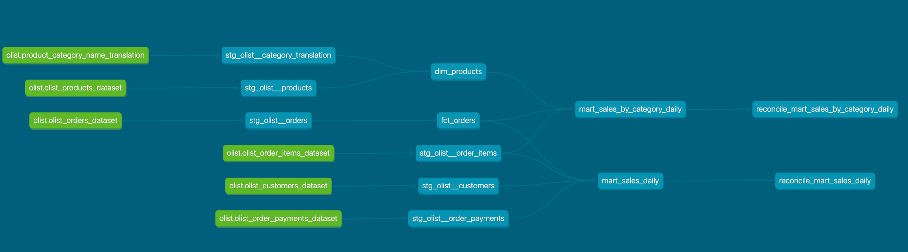

# Sales Analytics Pipeline

The project uploads data from CSV to the postgres database, then the data is transformed to marts.

CSV → Airflow DAG (load_raw.py) → Postgres raw → dbt (staging → core → marts)



## Run

```bash
git clone https://github.com/VladimirKorolev1986/sales-analytics-pipeline
cd sales-analytics-pipeline
python3 -m venv .venv
source .venv/bin/activate
pip install -r requirements.txt
cp .env.example .env
```

- Download https://www.kaggle.com/datasets/olistbr/brazilian-ecommerce

- Put the CSV files into data/raw/
```bash
docker compose up -d
```
- Open Airflow on http://localhost:8080

- Unpause the DAG, then click Trigger

- Login for Airflow: airflow
- Password for Airflow: airflow

```bash
set -a; source .env; set +a #export .env variables for dbt
cd sales_dbt
dbt build
```

## Done 
Downloading data from CSV → RAW (Python (Pandas, SQLAlchemy), Airflow)

## dbt models  
Core
- [dim_products.sql](sales_dbt/models/marts/core/dim_products.sql)
- [fct_orders.sql](sales_dbt/models/marts/core/fct_orders.sql)

Marts
- [mart_sales_by_category_daily.sql](sales_dbt/models/marts/sales/mart_sales_by_category_daily.sql)
- [mart_sales_daily.sql](sales_dbt/models/marts/sales/mart_sales_daily.sql)

## Tests  
- [_olist__models.yml](sales_dbt/models/staging/olist/_olist__models.yml)

- [assert_order_items_key.sql](sales_dbt/tests/assert_order_items_key.sql)

## Not done
Launching dbt from Airflow. 
Not modeled: reviews, sellers, geolocation.